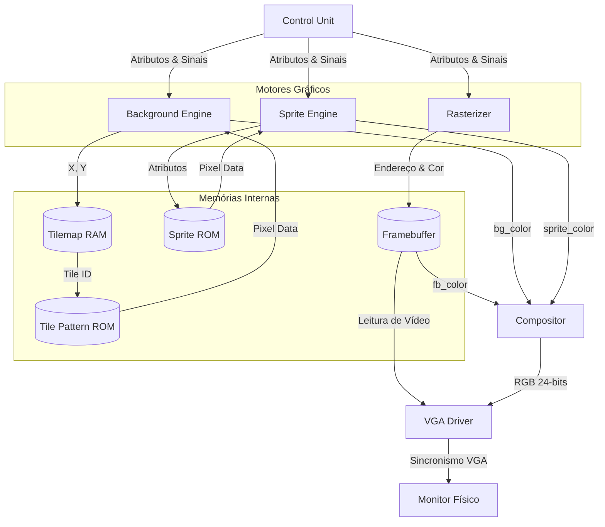
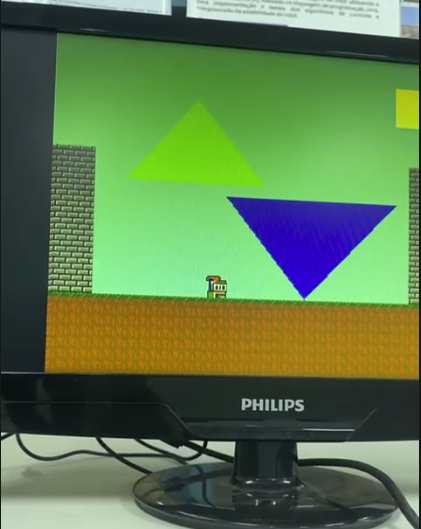
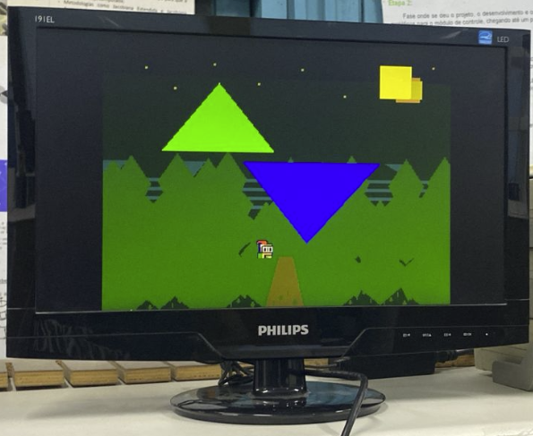

# Coprocessador Gráfico 2D em FPGA (DE1-SoC)

Este repositório contém a implementação em Verilog de um núcleo de coprocessador gráfico 2D em FPGA, desenvolvido como parte da disciplina de Sistemas Digitais (Problema #1). O projeto é inspirado na arquitetura de consoles de 16 bits e implementa suporte a plano de fundo baseado em tiles, sprites e rasterização de polígonos.

O objetivo do núcleo gráfico é gerar continuamente um sinal de vídeo VGA e receber comandos (futuramente, de um processador ARM rodando Linux) para manipulação de desenhos e renderização na tela.

---

## Levantamento de Requisitos

### Requisitos Funcionais

- **Geração de Sinal de Vídeo:** O sistema deve gerar um sinal de vídeo VGA em 640x480 pixels a 60 Hz.
- **Resolução Lógica:** A cena deve operar com resolução lógica de 320x240 pixels, com duplicação de pixels (pixel doubling) na saída.
- **Motor de Background:** Implementar uma camada de plano de fundo baseada em _tilemap_ de 40x30 posições, utilizando tiles de 8x8 pixels, permitindo deslocamento (scroll) horizontal e vertical.
- **Motor de Sprites:** Renderizar até 32 sprites independentes de 16x16 pixels, suportando posicionamento na tela, espelhamento, prioridade, habilitação e transparência (cor 0).
- **Rasterizador de Polígonos:** Desenhar e preencher formas geométricas primitivas (retângulos e triângulos preenchidos) em hardware utilizando aritmética inteira.
- **Compositor e Paleta de Cores:** Combinar todas as camadas (background, sprites, polígonos) respeitando regras de prioridade e transparência, e converter índices de cores (8 bits) em sinais RGB analógicos através de uma paleta de 256 cores programável.

### Requisitos Não Funcionais

- **Modularidade:** O código em Verilog deve ter separação clara entre controle, datapath, memórias, motores gráficos e saída de vídeo.
- **Estabilidade Visual:** O sinal de vídeo deve apresentar estabilidade visual durante a inicialização e operação contínua.
- **Inicialização:** Os registradores e memórias devem possuir uma estratégia definida para inicialização/reinicialização.
- **Hardware:** O projeto deve ser inteiramente sintetizável na placa Terasic DE1-SoC (Intel/Altera Cyclone V).

---

## Diagrama de Arquitetura

O diagrama abaixo ilustra o fluxo de dados (datapath) e a integração entre as unidades de processamento gráfico, o compositor e as memórias de vídeo.



---

## Motores Gráficos e Módulos Principais

A arquitetura do coprocessador é dividida em submódulos específicos para cada função gráfica. Abaixo estão descritos os motores de renderização responsáveis pela imagem.

### 1. Motor de Background (`background_engine.v`)

Responsável pela varredura contínua do chão/cenário base. Opera com um sistema de **pipeline de 3 estágios**:

- **Estágio 0:** Utiliza as coordenadas lógicas atuais para calcular o endereço da grade e consulta o **Tilemap (RAM)**.
- **Estágio 1:** Com o número (ID) do tile em mãos, acessa a **ROM de Padrões** para descobrir quais pixels compõem aquele tile.
- **Estágio 2:** Sincroniza e devolve a cor final.
  O motor suporta movimentação (scroll) com o efeito de _"wraparound"_ (repetição infinita do cenário ao chegar nas bordas).

### 2. Motor de Sprites (`sprite_engine.v`)

Gerencia e renderiza os objetos independentes e móveis da cena. Comporta até **32 sprites de 16x16 pixels** simultaneamente na tela.
Possui uma arquitetura que, a cada pixel renderizado, varre os atributos dos 32 sprites buscando se algum deles cobre a coordenada atual da tela.

- Realiza o espelhamento da imagem (Horizontal e Vertical) dinamicamente.
- Avalia as regras de **prioridade** entre dois sprites que se sobrepõem.
- Lida com a **transparência**: pixels mapeados para o valor de cor `0x00` são ignorados, deixando o que está "atrás" aparecer.

### 3. Rasterizador de Polígonos (`rasterizer.v`)

Uma máquina de estados sequencial (FSM) responsável por desenhar e preencher formas geométricas primitivas. A máquina itera sobre todos os pixels da _bounding box_ (caixa delimitadora retangular) da forma e decide se aquele pixel específico deve ser pintado ou não.

A lógica de preenchimento varia conforme a forma:

- **Retângulos:** A rasterização é direta. Define-se a origem em `(x0, y0)` e utiliza-se `(x1, y1)` como a largura e altura. Como a própria _bounding box_ percorrida pelo motor já é, por definição, o retângulo inteiro, a pertinência é imediata (`pixel_pertence = 1`). Todos os pixels varridos na área são gravados sequencialmente no Framebuffer.
- **Triângulos (Algoritmo de Equação de Bordas):** O preenchimento de triângulos utiliza um algoritmo baseado em vetores (Produto Vetorial).
  - O módulo recebe os 3 vértices do triângulo: `(x0,y0)`, `(x1,y1)` e `(x2,y2)`.
  - A máquina descobre e varre apenas a menor área retangular (_bounding box_) que engloba esses 3 pontos, para não desperdiçar ciclos processando a tela inteira.
  - Para cada pixel `P(x, y)` dessa área, o módulo calcula 3 equações de borda ($E_0$, $E_1$ e $E_2$), que indicam de qual lado o pixel está em relação a cada reta que forma o triângulo:
    - $E_0 = (P_x - x_0) \times (y_1 - y_0) - (P_y - y_0) \times (x_1 - x_0)$
    - $E_1 = (P_x - x_1) \times (y_2 - y_1) - (P_y - y_1) \times (x_2 - x_1)$
    - $E_2 = (P_x - x_2) \times (y_0 - y_2) - (P_y - y_2) \times (x_0 - x_2)$
  - **Condição de Pertinência:** Se os três resultados ($E_0$, $E_1$, $E_2$) tiverem **o mesmo sinal** (todos $\ge 0$ ou todos $\le 0$), isso prova matematicamente que o pixel encontra-se "do lado de dentro" das três retas e, portanto, no interior do triângulo. O rasterizador então grava a cor preenchida na respectiva posição de memória do Framebuffer.

### 4. Compositor (`compositor.v`)

O compositor recebe, **exatamente no mesmo ciclo de clock**, as informações de cor fornecidas pelo `background_engine`, `sprite_engine` e pelo `framebuffer` (polígonos do rasterizador).

- **Sobreposição:** O compositor resolve a visibilidade final baseando-se na transparência (cor `0`) e na prioridade das camadas. Sprites sobrepõem polígonos, que sobrepõem o background.
- **Paleta de Cores (LUT):** É no compositor onde as cores indexadas de 8-bits são consultadas em uma memória ROM/RAM rápida (`palette.hex`) para serem traduzidas nas cores analógicas reais (RGB 24-bits) enviadas ao VGA.

---

## Requisitos de Hardware e Software

- **Placa:** Terasic DE1-SoC (FPGA Intel/Altera Cyclone V `5CSEMA5F31C6`).
- **Monitor:** Compatível com entrada VGA 640x480 @ 60Hz.
- **Software de Síntese:** Intel Quartus Prime Lite Edition.
- **Software de Simulação:** ModelSim (Intel FPGA Edition).

---

## Como Rodar o Projeto

### 1. Síntese e Execução na FPGA

1. Clone este repositório no seu computador local:
   ```bash
   git clone https://github.com/Felpzs0206/pbl-sd-coprocessador-grafico.git
   ```
2. Abra o software **Quartus Prime**.
3. Vá em `File > Open Project` e selecione o arquivo **`PBL_SD.qpf`** localizado na raiz do repositório.
4. Defina o arquivo `teste_top` como entidade principal (*top-level*). Esse arquivo já instancia todos os submódulos (motores gráficos e memórias) aplicando um fluxo de exemplo para gerar a demonstração na tela.
5. No menu superior, clique em **Processing > Start Compilation** (ou aperte `Ctrl + L`) para realizar a Síntese (Analysis & Synthesis) e o roteamento (Fitter).
6. Aguarde o fim da compilação.
7. Conecte sua placa DE1-SoC ao computador (cabo USB Blaster) e ao monitor VGA. Ligue-a.
8. Vá em **Tools > Programmer**.
9. Confirme se o `Hardware Setup` está apontando para o _USB-Blaster_. Adicione o arquivo de configuração `.sof` (localizado dentro da pasta `output_files/`).
10. Marque a opção "Program/Configure" e clique em **Start**. A FPGA será gravada e o coprocessador iniciará a exibição no monitor instantaneamente.

### 2. Rodando Testes em Simulação (ModelSim)

O repositório está pronto para a verificação lógica das camadas.

1. Abra o **ModelSim**.
2. Altere o diretório base para a raiz do repositório.
3. Compile todos os arquivos da pasta `/rtl/` e o testbench que desejar da pasta `/tb/`.
4. Inicialize a simulação e deixe rodar tempo suficiente para a renderização do frame (os testbenches possuem scripts que escrevem arquivos de imagem `.ppm` contendo a saída gráfica em tempo de simulação para verificação das transparências e sobreposições).

---

## Resultados





## Funcionalidades Não Atendidas

- **Troca de Buffers (Double Buffering):** O requisito de utilização de troca de buffers para a memória de vídeo não pôde ser plenamente atendido no prazo. Como não implementamos o _double buffer_, eventuais atualizações de polígonos sendo gravadas na memória ao mesmo tempo em que a tela está sendo exibida podem ocasionar pequenos artefatos ou recortes visuais indesejados (_flickering_).

## Melhorias Futuras

- **Implementação do Double Buffer:** Adicionar um banco duplo de memórias para o Framebuffer, permitindo que as renderizações do quadro seguinte ocorram em um buffer oculto enquanto o controlador VGA lê os dados do quadro atual exibido na tela.
- **Movimentação e Edição de Polígonos:** Expandir a arquitetura do rasterizador para suportar de forma mais intuitiva o deslocamento e a mudança de cor de objetos poligonais já rasterizados, sem a necessidade constante de limpar e repintar toda a cena base no Framebuffer.
- **Ampliação do Datapath:** Otimizar as buscas de memórias para permitir a renderização de cenários mais avançados ou aumentar a quantidade de sprites exibidos em uma única linha horizontal.
